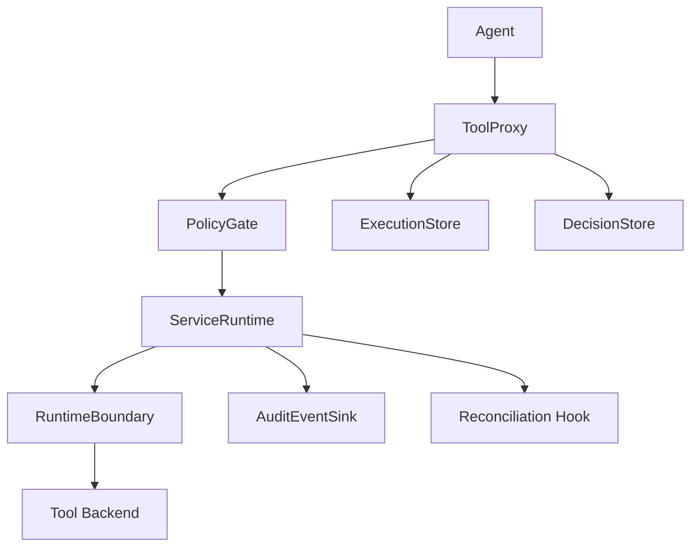

# Architecture Overview

Koguchi / CAH の全体構造と責務分離。

## Koguchi / CAH の目的

AIエージェントやアプリケーションが外部世界へ副作用を起こすとき、その副作用を監査可能な実行来歴へ変換する。

## 全体構造

## 責務分離

### ToolProxy

Agent から見た唯一の副作用実行経路。PolicyGate と ServiceRuntime を接続する。すべての管理対象副作用は必ず ToolProxy を通る。

### PolicyGate

envelope / policy 上の許可判定を行う。判定結果は allow / deny / require_approval の3値。PolicyGate は RuntimeBoundary を置き換えない。

### RuntimeBoundary

tool / env / workspace / runtime 上の実行時境界を判定する。Python 実装は best-effort であり完全封じ込めではない。Rust chokepoint や OS レベル隔離に差し替え可能な Protocol として設計されている。

### ServiceRuntime

RuntimeBoundary 判定、tool execution、audit event emission を束ねる accountable execution surface。権限主体ではなく観測可能な実行面である。

### AuditGate

アプリケーションが依存する唯一の Koguchi インターフェース。内部実装（ActionEnvelope, ExecutionStore, hash chain）を隠蔽する。

### Reconciliation

Store と実世界（ファイルシステム／外部 API）の照合。診断は最尤推定であり、確定的真実ではない。confidence 値で推定の確からしさを表現する。

### Redaction / Secret Safety

監査ログの開示制御。RedactionPolicy は full / without_intent / without_context / minimal の4分類。FULL でも secret-like key は常にマスクされる。

### RDE / T-RDE

RDE（Resonant Deviation Evaluator）は、生成された変更が元の設計意図を保存しているのか、許可された変換なのか、補完なのか、あるいは逸脱なのかを評価するための構造である。

T-RDE はこの考え方をテストに適用する。テストは単なる振る舞い確認ではなく、システムの意味・設計意図・アーキテクチャ制約を守るためのものとして扱う。

RDE は PolicyGate の代替ではない。RDE は security sandbox ではない。

## 現時点で実装していないもの

- persistent audit store（v0.2 候補）
- reconciliation scheduler（v0.3 候補）
- Rust chokepoint（v0.4 候補）
- full dashboard observation plane（v0.5 候補）
- remote API server（Future）
- seccomp / container isolation / network namespace / macOS sandbox（Future）

## 参照

- [ADR index](adr/) — 設計判断の正本
- [Known Limitations](../known-limitations.md) — 現状の制約
- [Roadmap](../roadmap.md) — 全体フェーズ計画
