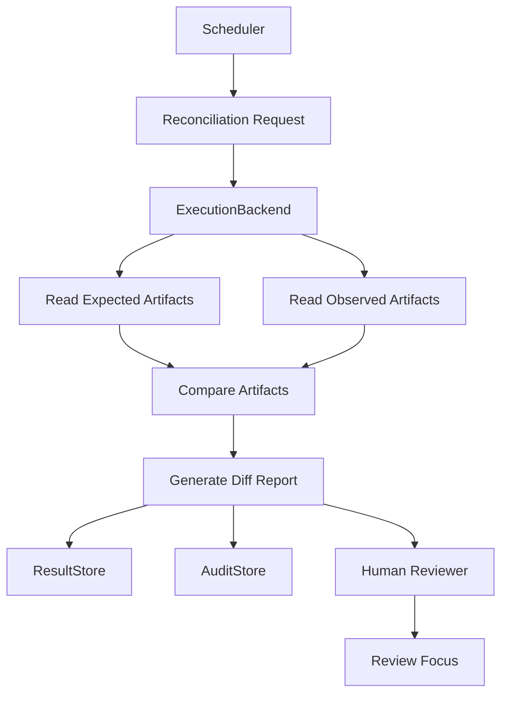

# Filesystem Diff Reconciliation Example

## Status

**Example Design** — not an implementation.

This document designs a concrete read-only filesystem reconciliation example based on the v0.10 backend-specific reconciliation design gate. No reconciliation code is implemented here.

## Purpose

This example describes a read-only filesystem reconciliation flow that compares expected file artifacts with observed filesystem artifacts. It reports differences for human review. It does not repair, overwrite, delete, deploy, or commit files.

この例は、期待されたファイル成果物と観測されたファイル成果物を read-only に照合し、差分を人間レビュー用に報告する。修復・上書き・削除・デプロイ・コミットは行わない。

## Boundary Statement

- This example is not a security sandbox.
- This example is not a control plane.
- This example does not mutate files.
- This example does not perform automatic recovery.
- This example does not decide correctness.
- This example only produces review focus.

## Actors / Components

| Component | Role |
|-----------|------|
| **Scheduler** | Requests when reconciliation should run (timing only, not correctness) |
| **ToolProxy** | Remains the side-effect chokepoint |
| **ExecutionBackend** | Provides read-only filesystem observation |
| **AuditStore** | Records reconciliation request and observation metadata |
| **ResultStore** | Stores observed artifact summaries and diff reports |
| **Human reviewer** | Decides whether observed differences matter |

Key: Scheduler handles timing only. ExecutionBackend observes only. ToolProxy is the chokepoint. Reconciliation does not repair. The human reviewer decides.

## Input Model

```yaml
reconciliation_input:
  backend_id: filesystem-local
  execution_id: exec-2026-06-06-001
  expected_artifacts:
    - path: output/report.json
      sha256: optional-expected-hash
    - path: output/summary.md
  observed_root: ./output
  ignored_paths:
    - .DS_Store
    - "*.tmp"
  timestamp_tolerance_seconds: 2
  audit_event_refs:
    - audit-0001
  result_store_refs:
    - result-0001
```

Note: This is a design example, not a stable schema. It is not a Rust protocol specification and not a remote API.

## Output Model

```yaml
reconciliation_output:
  status: mismatch_observed
  summary: >
    Differences were observed between expected and observed
    filesystem artifacts.
  observed_differences:
    - path: output/report.json
      kind: modified
      evidence:
        expected_sha256: optional-expected-hash
        observed_sha256: observed-hash
    - path: output/extra.log
      kind: added
  missing_artifacts:
    - output/summary.md
  stale_artifacts: []
  audit_gaps: []
  recommended_review_focus:
    - Review modified report.json before treating this run as complete.
    - Review missing summary.md before retrying or regenerating artifacts.
```

## Status Values

| Status | Meaning |
|--------|---------|
| `matched` | Expected and observed align |
| `mismatch_observed` | Differences found — review focus, not action |
| `missing_expected_artifact` | Expected artifact not in observed |
| `missing_observed_artifact` | Observed artifact has no expectation |
| `stale_observation` | Observation older than threshold |
| `audit_gap` | Audit record missing |
| `inconclusive` | Cannot determine alignment |

## Diff Kinds

| Kind | Meaning | Not |
|------|---------|-----|
| `added` | In observed, not in expected | Not auto-adopt |
| `removed` | In expected, not in observed | Not auto-delete |
| `modified` | Path matches, content/metadata differs | Not auto-overwrite |
| `unchanged` | Expected and observed match | — |
| `ignored` | Excluded by ignored_paths | — |
| `unknown` | Insufficient information | — |

## Prohibited Actions

- No automatic delete
- No automatic overwrite
- No automatic rollback
- No automatic commit
- No automatic deploy
- No automatic retry
- No backend mutation
- No remote API
- No control-plane decision
- No safety decision

## Example Flow



## RDE Consistency Check

### Preserved

- ToolProxy remains the side-effect chokepoint.
- Filesystem reconciliation remains read-only.
- Koguchi remains not a security sandbox.
- Koguchi remains not a control plane.
- Dashboard / report output remains observation plane.

### Transformed

- v0.10 design gate is transformed into one concrete filesystem diff example.

### Complemented

- Expected/observed artifact comparison is made concrete.
- Diff kinds are clarified.
- Review focus output is illustrated.

### Intentionally unresolved

- Reconciliation implementation.
- Stable Rust protocol.
- ResultStore schema.
- AuditStore persistence details.
- Remote API / web server.
- Crypto sealing.

### Deviation risks

- Filesystem diff may be mistaken for automatic repair.
- `removed` may be mistaken for delete instruction.
- `modified` may be mistaken for overwrite instruction.
- `mismatch_observed` may be mistaken for failure verdict.

### Next update policy

- Keep this example non-executable until implementation boundary is reviewed.
- Add implementation spike only after the example's read-only boundary is accepted.
