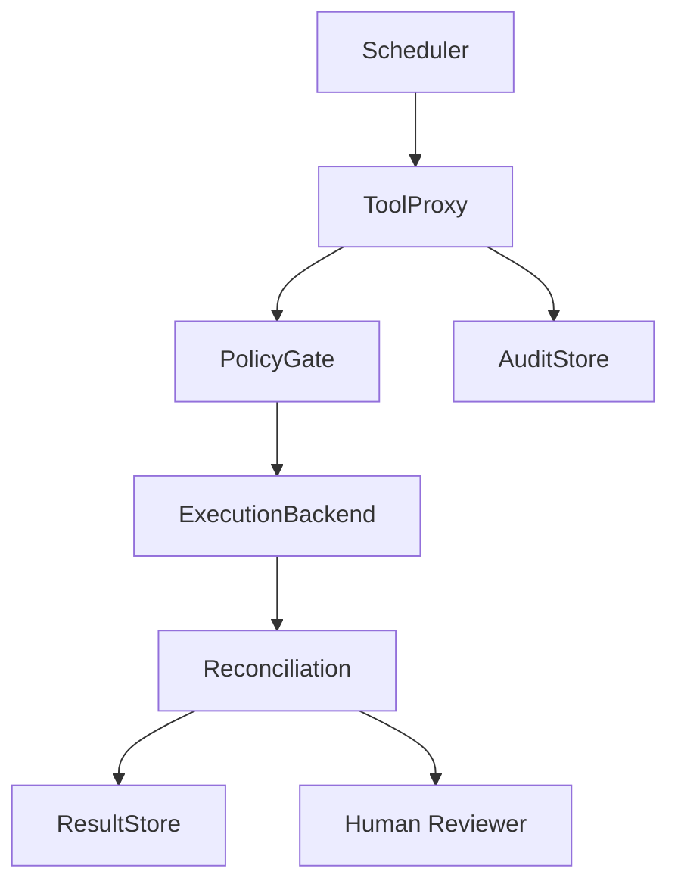

# v0.11 ToolProxy Reconciliation Integration Design Gate

## Status

**Design Gate** — not an implementation.

This document defines how read-only reconciliation checks may later be requested through ToolProxy without turning reconciliation into a control plane, repair mechanism, scheduler decision, or security sandbox.

## Purpose

この設計ゲートは、read-only reconciliation check を将来 ToolProxy 経由で要求する場合の境界を定義する。reconciliation を制御平面、修復機構、Scheduler 判断、セキュリティサンドボックスに変えないことを目的とする。

## Core Boundary

- ToolProxy remains the side-effect chokepoint.
- Reconciliation remains read-only observation.
- ToolProxy may route a reconciliation request.
- ToolProxy must not interpret mismatch as enforcement.
- ToolProxy must not repair, delete, overwrite, rollback, commit, deploy, or retry.
- ToolProxy must not turn reconciliation status into a control decision.

## Component Responsibilities

### ToolProxy

- Accepts an explicit reconciliation request.
- Applies PolicyGate checks to whether the request may be observed.
- Routes to a read-only ExecutionBackend observation path.
- Records request metadata to AuditStore if available.
- Does not repair or enforce.

### PolicyGate

- Allows or denies whether a reconciliation observation may be requested.
- Does not decide whether the observed artifact is correct.

### ExecutionBackend

- Performs backend-specific read-only observation.
- Does not mutate backend state.

### Reconciliation

- Compares expected and observed artifacts.
- Produces review-focused output.

### AuditStore

- Records the request and observation metadata.
- Does not decide correctness.

### ResultStore

- Stores or references reconciliation output.
- Does not approve or reject results.

### Human Reviewer

- Decides whether differences matter.

## Allowed Request Shape

Design draft only — not a stable protocol, not a remote API, not a production schema.

```yaml
toolproxy_reconciliation_request:
  request_id: rec-req-0001
  kind: filesystem_diff_reconciliation
  backend_id: filesystem-local
  execution_id: exec-2026-06-06-001
  expected_artifacts_ref: result-expected-0001
  observed_root_ref: local-output-root
  audit_event_refs:
    - audit-0001
  mode: read_only
```

## Allowed Response Shape

```yaml
toolproxy_reconciliation_response:
  request_id: rec-req-0001
  status: mismatch_observed
  result_ref: reconciliation-result-0001
  review_focus:
    - Review modified output/report.json before treating this run as complete.
  boundary:
    read_only: true
    no_repair: true
    no_control_decision: true
```

## Prohibited Behavior

- No automatic repair.
- No automatic delete / overwrite / rollback / commit / deploy / retry.
- No backend mutation.
- No correctness verdict.
- No safety verdict.
- No control-plane decision.
- No scheduler-driven autonomous repair.
- No bypass around ToolProxy.

## Scheduler Relationship

- Scheduler may request that a reconciliation check be considered.
- Scheduler does not decide backend correctness.
- Scheduler does not perform reconciliation directly.
- Scheduler does not mutate backend state.
- Scheduler must route through ToolProxy if reconciliation is requested.

Critical: `Scheduler → Reconciliation` direct connection is prohibited. The path must be: `Scheduler → ToolProxy → read-only ExecutionBackend → Reconciliation`.

## Relation to v0.10 Spike

The v0.10 filesystem diff reconciliation spike remains a standalone read-only implementation. This v0.11 design gate does not wire it into ToolProxy. It only defines the conditions under which such integration may later be implemented.

## Flow



Key: Scheduler routes through ToolProxy. ExecutionBackend is read-only observation. Human Reviewer is the decision layer.

## RDE Consistency Check

### Preserved

- ToolProxy remains the side-effect chokepoint.
- Reconciliation remains read-only.
- Koguchi remains not a security sandbox.
- Koguchi remains not a control plane.
- Human review remains the decision layer.

### Transformed

- The v0.10 standalone reconciliation spike is transformed into a future ToolProxy integration design target.

### Complemented

- ToolProxy / PolicyGate / Scheduler / ExecutionBackend boundaries are clarified.
- A draft request/response shape is added for review.
- Scheduler bypass risk is made explicit.

### Intentionally unresolved

- Actual ToolProxy integration.
- Scheduler integration.
- AuditStore / ResultStore persistence.
- CLI / remote API / web server.
- Rust protocol stabilization.
- Crypto sealing.

### Deviation risks

- ToolProxy routing may be mistaken for control-plane behavior.
- Scheduler request may be mistaken for autonomous repair.
- `mismatch_observed` may be mistaken for enforcement.
- Reconciliation result may be mistaken for correctness verdict.

### Next update policy

- Implement ToolProxy integration only after this design gate is accepted.
- Keep integration read-only.
- Add tests that prove no mutation, no repair, and no scheduler bypass.
