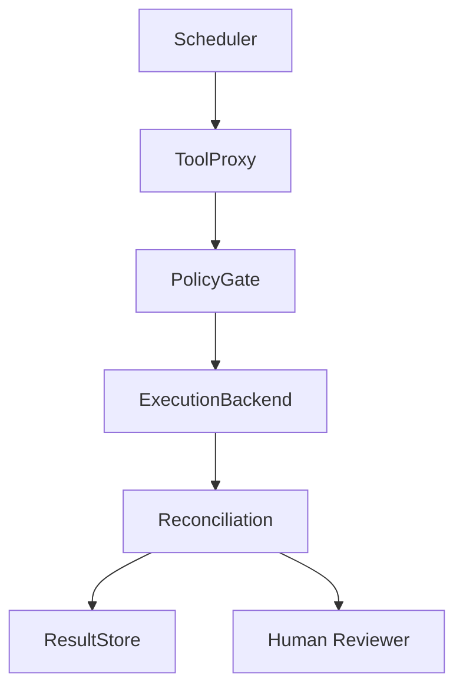

# v0.12 Scheduler Reconciliation Design Gate

## Status

**Design Gate** — not an implementation.

This document defines how a Scheduler may request consideration of a reconciliation check without performing reconciliation directly, bypassing ToolProxy, or turning mismatch observations into retry, repair, deployment, or correctness decisions.

## Purpose

この設計ゲートは、Scheduler が reconciliation check の検討を要求する場合の境界を定義する。Scheduler は reconciliation を直接実行せず、ToolProxy を迂回せず、mismatch 観測を retry・repair・deploy・正誤判断に変換しない。

## Core Boundary

- Scheduler decides when a reconciliation check may be requested.
- Scheduler does not perform reconciliation.
- Scheduler does not call reconciliation backend directly.
- Scheduler must route through ToolProxy.
- Scheduler does not interpret mismatch as failure, enforcement, or retry trigger.
- Scheduler does not mutate backend state.
- Scheduler does not repair, delete, overwrite, rollback, commit, deploy, or retry.

## Required Path

唯一許可される経路:

```
Scheduler
  → ToolProxy
  → PolicyGate
  → read-only ExecutionBackend observation
  → Reconciliation
  → ResultStore or response object
  → review focus
  → Human Reviewer
```

禁止経路:

- Scheduler → Reconciliation (direct)
- Scheduler → ExecutionBackend mutation
- Scheduler → retry/repair
- Scheduler → deploy/commit
- Scheduler → correctness verdict

## Component Responsibilities

### Scheduler

- Determines timing or eligibility for requesting a reconciliation observation.
- Does not perform reconciliation / decide correctness / trigger repair or retry.

### ToolProxy

- Remains the side-effect chokepoint.
- Receives Scheduler-originated request.
- Routes only allowed read-only reconciliation requests.
- Does not interpret mismatch as enforcement.

### PolicyGate

- Checks whether a reconciliation observation request is allowed.
- Does not decide correctness of observed artifact.

### ExecutionBackend

- Performs read-only observation only. Does not mutate backend state.

### Reconciliation

- Compares expected and observed artifacts. Produces review-focused output.

### AuditStore / ResultStore

- May record metadata in future integration. Does not decide correctness or approve/reject.

### Human Reviewer

- Decides whether differences matter.

## Scheduler Request Draft

Design draft, not a stable protocol.

```yaml
scheduler_reconciliation_request:
  request_id: sched-rec-0001
  trigger:
    kind: manual_or_scheduled_check
    reason: review_pending_artifacts
  reconciliation:
    kind: filesystem_diff_reconciliation
    backend_id: filesystem-local
    execution_id: exec-2026-06-06-001
    expected_artifacts_ref: result-expected-0001
    observed_root_ref: local-output-root
    mode: read_only
  route:
    via: ToolProxy
```

## Scheduler Response Draft

```yaml
scheduler_reconciliation_result:
  request_id: sched-rec-0001
  routed_via: ToolProxy
  reconciliation_status: mismatch_observed
  review_focus_ref: reconciliation-result-0001
  scheduler_action:
    retry: false
    repair: false
    deploy: false
    correctness_decision: false
```

`retry: false` は境界確認であり、retry policy の実装ではない。

## Prohibited Behavior

- No Scheduler-to-Reconciliation direct call.
- No Scheduler-to-ExecutionBackend mutation.
- No automatic retry / repair / delete / overwrite / rollback / commit / deploy.
- No correctness / safety / enforcement verdict.
- No bypass around ToolProxy.

## Relation to v0.11

The v0.11 ToolProxy-facing reconciliation spike remains the only implemented request path. This v0.12 design gate does not implement Scheduler integration. It defines the conditions under which Scheduler-originated reconciliation requests may later be introduced.

## Flow



## RDE Consistency Check

### Preserved
- ToolProxy remains chokepoint. Reconciliation remains read-only.
- Koguchi not security sandbox / control plane. Human review is decision layer.

### Transformed
- v0.11 ToolProxy-facing spike → Scheduler-originated request design target.

### Complemented
- Scheduler/ToolProxy routing boundary, bypass risk, retry/repair prohibition.

### Intentionally unresolved
- Scheduler integration / persistence / job queue. Audit/Result store persistence.
- CLI / Rust protocol / remote API / crypto sealing.

### Deviation risks
- Scheduler request mistaken for retry. Routing mistaken for control-plane.
- mismatch_observed mistaken for failure verdict. Scheduler bypass temptation.

### Next
- Scheduler integration only after design gate accepted.
- Tests must prove no bypass, no retry, no repair.
