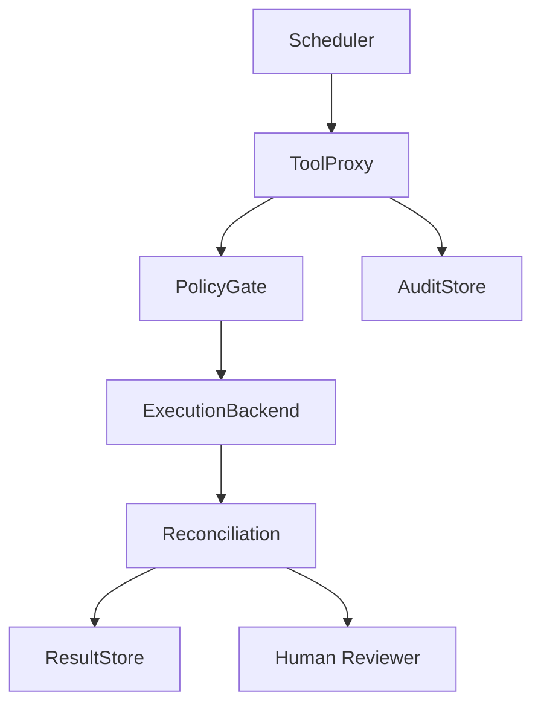

# v0.13 Reconciliation Persistence Design Gate

## Status

**Design Gate** — not an implementation.

## Purpose

この設計ゲートは、reconciliation request メタデータと reconciliation output を将来 AuditStore / ResultStore に記録する場合の境界を定義する。保存は正誤判断、強制、retry policy、repair policy、control-plane behavior ではない。

## Core Boundary

- AuditStore records request and observation metadata.
- ResultStore records reconciliation output or references.
- AuditStore does not decide correctness.
- ResultStore does not decide correctness.
- Persistence does not imply approval or failure.
- Persistence does not trigger retry, repair, deploy, commit, or rollback.
- Persistence is not a control plane.
- Persistence is not a security sandbox.

## Component Responsibilities

| Component | Role |
|-----------|------|
| Scheduler | May request consideration. Does not persist correctness decisions. |
| ToolProxy | Routes allowed read-only reconciliation. May pass metadata to AuditStore. |
| PolicyGate | Determines if observation is allowed. Does not judge correctness. |
| ExecutionBackend | Read-only observation. No mutation. |
| Reconciliation | Compares expected/observed. Produces review-focused output. |
| **AuditStore** | Records request metadata, route, timestamp, boundary flags. No approval/rejection. |
| **ResultStore** | Records reconciliation output. No correctness decision. |
| Human Reviewer | Interprets records. Decides what matters. |

## AuditStore Draft Record

Design draft, not a stable schema.

```yaml
audit_record:
  audit_id: audit-rec-0001
  request_id: sched-rec-0001
  route:
    via: [Scheduler, ToolProxy, PolicyGate, ExecutionBackend, Reconciliation]
  backend_id: filesystem-local
  execution_id: exec-2026-06-06-001
  reconciliation_kind: filesystem_diff_reconciliation
  mode: read_only
  requested_at: 2026-06-06T00:00:00Z
  result_ref: reconciliation-result-0001
  boundary:
    read_only: true
    no_repair: true
    no_retry: true
    no_control_decision: true
```

## ResultStore Draft Record

```yaml
result_record:
  result_id: reconciliation-result-0001
  request_id: sched-rec-0001
  status: mismatch_observed
  summary: Differences were observed between expected and observed.
  observed_differences:
    - path: output/report.json
      kind: modified
  missing_artifacts: [output/summary.md]
  recommended_review_focus:
    - Review modified report.json before treating this run as complete.
  boundary:
    review_focus_only: true
    correctness_decision: false
    enforcement: false
```

## Prohibited Behavior

No stored result may trigger automatic retry/repair/delete/overwrite/rollback/commit/deploy.
No stored result is a correctness/safety verdict, approval/rejection, or control-plane enforcement.

## Status Interpretation

| Status | Meaning | Not |
|--------|---------|-----|
| matched | No differences observed | Not approval |
| mismatch_observed | Differences found | Not failure |
| missing_expected_artifact | Expected artifact missing | Review focus |
| missing_observed_artifact | Observed artifact missing | Review focus |
| stale_observation | May be stale | Review focus |
| audit_gap | Audit record gap | Review focus |
| inconclusive | Cannot determine | Review focus |

## Flow



## RDE

### Preserved
ToolProxy chokepoint. Reconciliation read-only. Scheduler routes via ToolProxy. Stores do not decide correctness. Not control plane/sandbox. Human reviewer is decision layer.

### Transformed
v0.12 Scheduler spike → future persistence design target.

### Complemented
AuditStore/ResultStore boundaries, draft records, status interpretation table.

### Unresolved
Persistence implementation, storage backend, schema versioning, retention, CLI, remote API, Rust, crypto.

### Deviation risks
Stored mismatch mistaken for failure. Stored matched mistaken for approval. ResultStore mistaken for control-plane state.

### Next
Implement persistence only after gate accepted. Tests must prove stored records do not trigger retry/repair/deploy.
