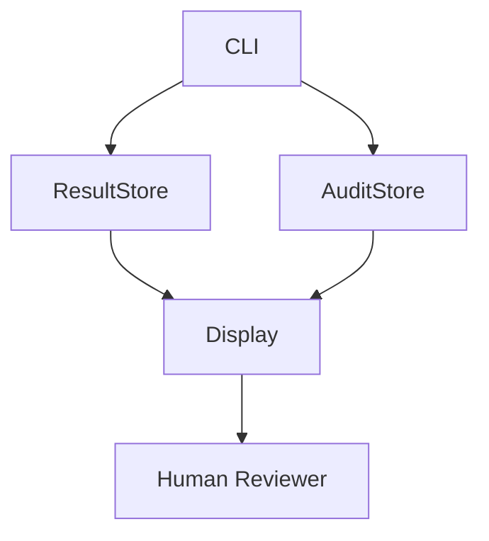

# v0.14 CLI Read-only Inspection Design Gate

## Status

**Design Gate** — not an implementation.

## Purpose

この設計ゲートは、将来の CLI が reconciliation records を inspection する場合の境界を定義する。CLI は制御平面、修復ツール、retry trigger、承認 UI、正誤判断エンジンになってはならない。

## Core Boundary

- CLI may read reconciliation records.
- CLI may display reconciliation status, review focus, and boundary flags.
- CLI must not mutate records, retry execution, repair artifacts, deploy, commit, rollback, delete, overwrite, approve, reject, or decide correctness.
- CLI must not turn mismatch into failure verdict.

## Allowed Commands (Draft)

```
koguchi reconciliation list          # List result records
koguchi reconciliation show <id>     # Show one result + review focus
koguchi reconciliation audit <id>    # Show one audit record
```

## Prohibited Commands

`koguchi reconciliation retry|repair|approve|reject|deploy|commit|rollback|delete|enforce` — explicitly prohibited.

## Display Language

CLI output is observation, not judgment.

**Allowed:** `status: mismatch_observed`, `review_focus: Review modified report.json...`, `boundary: read_only: true`

**Forbidden:** `failed`, `invalid`, `unsafe`, `approved`, `rejected`, `must retry`, `must repair`, `deploy blocked`, `correct`, `incorrect`

## Exit Code Policy (Draft)

- `0`: command executed successfully (regardless of reconciliation status)
- `1`: CLI usage error or record not found
- `2`: internal inspection error

`mismatch_observed` returns 0. Reconciliation status is not process failure.

## Component Responsibilities

| Component | Role |
|-----------|------|
| CLI | Reads/display records. No mutation. |
| AuditStore | Provides records for inspection. |
| ResultStore | Provides results for inspection. |
| Human Reviewer | Interprets review focus, decides action. |

## Flow



CLI reads stores only. Does not invoke ToolProxy/Scheduler/ExecutionBackend.

## Non-goals

No CLI implementation, retry/repair/approve/reject/deploy/commit/rollback/delete commands, backend/store mutation, remote API, web server, Rust, crypto.

## RDE

Preserved: Records remain observation artifacts, stores do not decide correctness, not control plane/sandbox, Human reviewer decision layer.
Transformed: v0.13 persistence → CLI inspection design target.
Complemented: Command boundaries, prohibited commands list, exit code policy.
Unresolved: CLI implementation, output format, store backend, remote API, Rust, crypto.
Deviation risks: Status display mistaken for judgment, non-zero exit mistaken for failure, CLI pressured into retry/repair.
Next: Implement only read-only inspection after gate accepted. Test mismatch produces exit 0.
